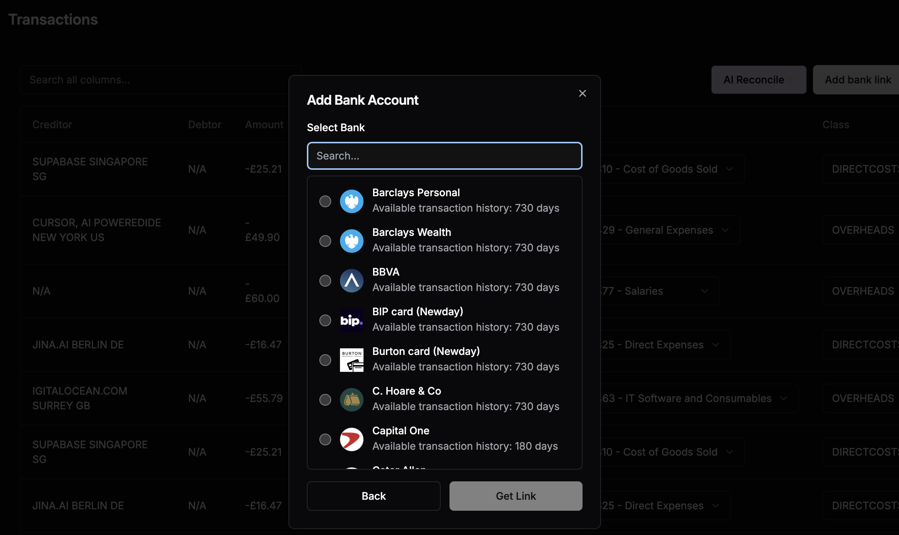
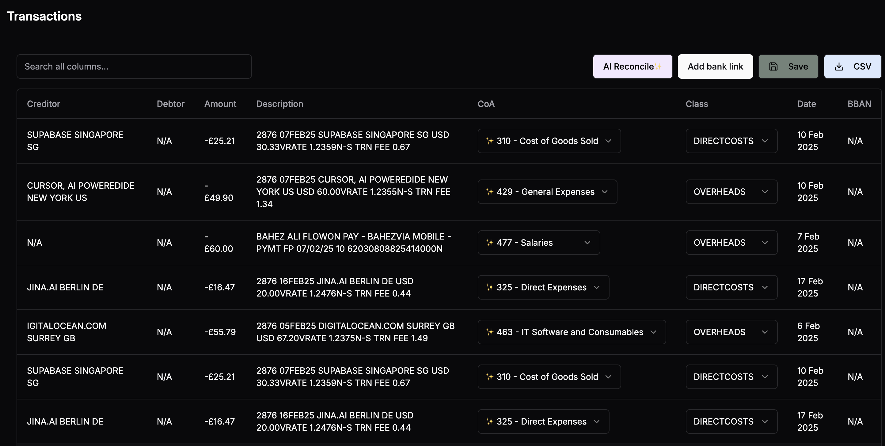
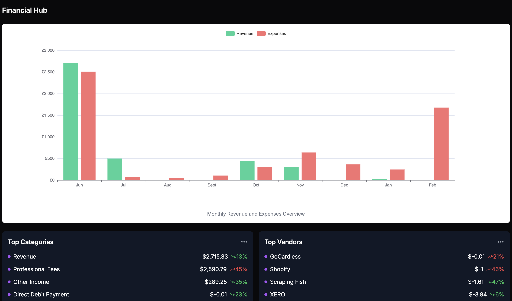

# Bankstream.io

## Overview
Bankstream.io is a modern financial data processing and analysis platform that helps businesses streamline their banking operations. The platform integrates with various financial services, processes transactions, and provides intelligent insights through machine learning capabilities.

## Features
- 🏦 Banking integration with multiple providers
- 💳 Transaction processing and enrichment
- 📊 Advanced analytics and reporting
- 🤖 AI-powered categorization and insights
- 📈 Real-time data visualization
- 🔐 Secure authentication with Clerk

## Application Screenshots

### Bank Connection

*Easily connect your bank accounts through our secure integration interface*

### Transaction Management

*View, categorize, and manage all your transactions in one place*

### Analytics Dashboard

*Get powerful insights with our interactive analytics dashboard*

## Tech Stack

### Frontend
- **Framework**: [Remix.js](https://remix.run/) with TypeScript
- **UI Components**: 
  - Tailwind CSS for styling
  - Radix UI for accessible components
  - ECharts for data visualization
- **State Management**: React hooks and context
- **Authentication**: Clerk

### Backend
- **Language**: Python 3.10+
- **API Framework**: FastAPI
- **Database**: Supabase
- **Financial Integrations**:
  - GoCardless (for bank data link)
  - Xero (for chart of accounts)
  - Ntropy (for entity & category enrichment)
  - Brave search API (to contextualise entity names)
  - OpenAI (for inference to make chart of account matching decision)


## Prerequisites
- Node.js >= 20.0.0
- Python >= 3.10

## Getting Started

### Frontend Setup
1. Navigate to the frontend directory:
```bash
cd frontend
```

2. Install dependencies:
```bash
npm install
```

3. Create a `.env` file based on `.env.example` and configure your environment variables:
```bash
cp .env.example .env
```

4. Start the development server:
```bash
npm run dev
```

### Backend Setup
1. Navigate to the backend directory:
```bash
cd backend
```

2. Create and activate a virtual environment:
```bash
python -m venv venv
source venv/bin/activate  # On Windows: venv\Scripts\activate
```

3. Install dependencies:
```bash
pip install -r requirements.txt
```

4. Configure environment variables:
```bash
cp .env.example .env
```

5. Start the backend server:
```bash
uvicorn app.main:app --reload
```

## Development

### Code Style
- Frontend follows ESLint configuration
- Backend follows PEP 8 guidelines
- Use TypeScript for type safety in frontend code


## Deployment
The application can be deployed using your preferred hosting solution. Make sure to:
1. Set up all required environment variables
2. Configure your database connection
3. Set up authentication providers
4. Configure CORS and security settings
